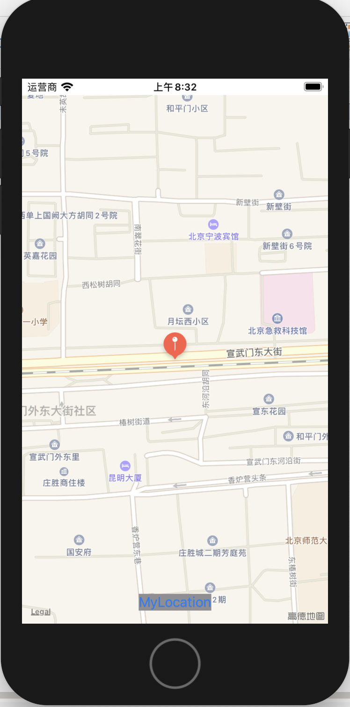
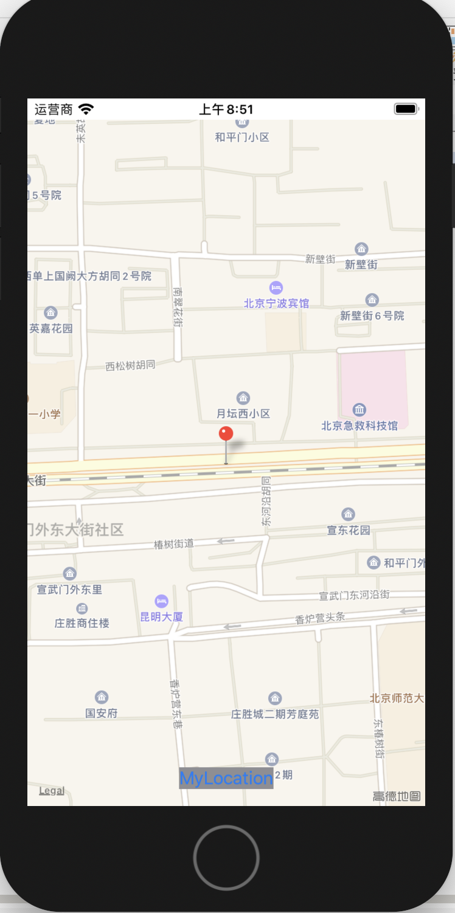
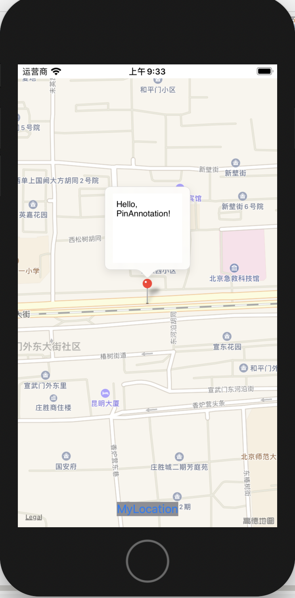
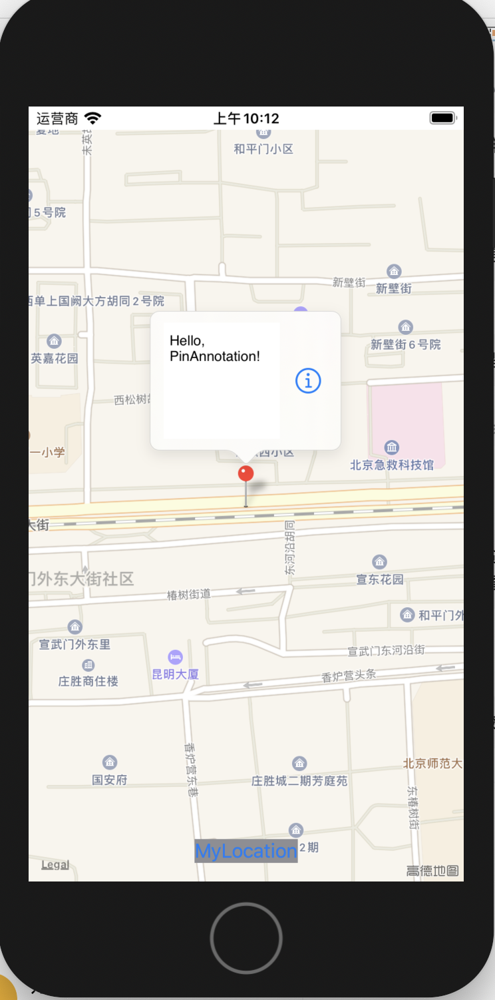
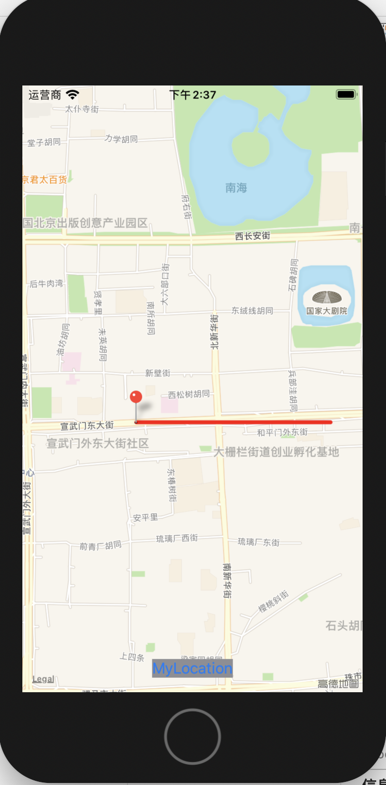
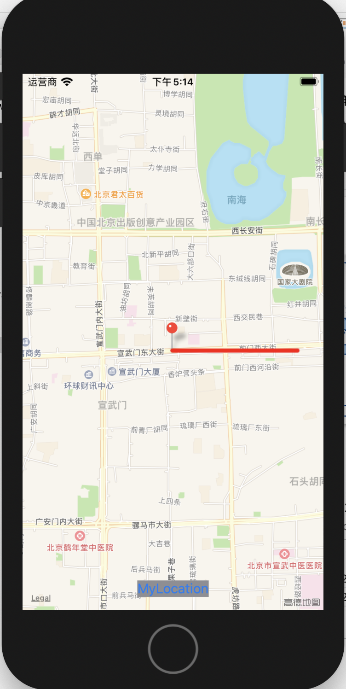

# 在SwiftUI中使用MKMapView

SwiftUI是个好东西，让我们方便进行UI的布局；可如果做得应用和地图有关，那么就没有那么舒心了，因为SwiftUI里面没有封装地图的控件！如果需要使用地图的话，那么我们必须自己动手，将MKMapView给包装进来！好吧，那么我们现在就来看下，如果进行封装吧！

## 基础用法

### 封装MKMapKit

对于UIKit里面的组件，如果我们需要在SwiftUI中使用，只需要在封装的时候满足UIViewRepresentable协议，也就是实现makeUIView(context:)和updateUIView(**_**: , context:) 函数即可。是不是很简单？基于此，我们可以很简单地将MKMapView给包装起来：

```swift
import MapKit
import SwiftUI

struct MapViewWrapper: UIViewRepresentable {
    func makeUIView(context: Context) -> MKMapView {
        let mapView = MKMapView(frame: .zero)
        return mapView
    }

    func updateUIView(_ view: MKMapView, context: Context) {
    }
}

```

使用的时候，和正常的SwiftUI组件没有任何差别，如：

```swift
import SwiftUI

struct ContentView: View {
    var body: some View {
        MapViewWrapper()
    }
}
```

运行程序，我们就能看到激动人心的画面了：


### 设置Frame

如果仔细查看代码，会发现我们之前将frame设置为0，如：

```swift
let mapView = MKMapView(frame: .zero)
```

虽然在实际使用中，运行起来的时候会自动适配，但给人的感觉总是不够完美，就像有鲠在喉一样，难受。那么我们改如何获取MKMapView的应有大小呢？这个时候就要使用GeometryReader了。

我们新建一个MapView的结构体，然后在此结构体中使用GeometryReader将MapViewWrapper给包装起来，并且初始化的时候将父窗口的大小传递给MapViewWrapper，如：

```swift
struct MapView: View {
    var body: some View {
        return GeometryReader { geometryProxy in
            MapViewWrapper(frame: CGRect(x: geometryProxy.safeAreaInsets.leading,
                                         y: geometryProxy.safeAreaInsets.trailing,
                                         width: geometryProxy.size.width,
                                         height: geometryProxy.size.height))
        }
    }
}

struct MapViewWrapper: UIViewRepresentable {
    var frame: CGRect

    func makeUIView(context: Context) -> MKMapView {
        let mapView = MKMapView(frame: frame)
        return mapView
    }

    func updateUIView(_ view: MKMapView, context: Context) {
    }
}
```

使用的地方，自然是要将MapViewWrapper给修改为MapView了：

```swift
struct ContentView: View {
    var body: some View {
        MapView()
    }
}
```

这样看来，凡是封装的UIKit组件，都先封装，然后再放到一个struct View中，似乎能省不少麻烦。但是，问题来了，在实际上，如果采用这种封装的方式，那么在使用@ObservableObject这种属性的时候，很有可能在数据变化的时候，无法收到变化的通知。所以这里只是说明怎么能够获取frame而已，但在下面的例子中，我们还是要将这个将MapViewWrapper放到MapView中去的这种方式取消的。

### 监控缩放的比例

如果我们使用双手来缩放地图的话，那么我们如何获知此时缩放的倍数呢？这个时候就需要使用上代理了。所谓的代码，就是实现了MKMapViewDelegate协议的类。我们为了保存数据，这里还新建了一个MapViewState的类。之所以这样考量，是鉴于设计模式的原则，将数据和状态分开。

首先是MapViewState类，比较简单，只有一个属性：

```swift
import MapKit

class MapViewState: ObservableObject {
    var span: MKCoordinateSpan?
}

```

接着是MapViewDelegate类，它需要实现MKMapViewDelegate协议，并且为了检测到缩放的事件，还必须实现mapView(**_** mapView: MKMapView, regionDidChangeAnimated: Bool)函数：

```swift
import MapKit

class MapViewDelegate: NSObject, MKMapViewDelegate {
    var mapViewState : MapViewState
    
    init(mapViewState : MapViewState){
        self.mapViewState = mapViewState
    }
    
    func mapView(_ mapView: MKMapView, regionDidChangeAnimated: Bool) {
        mapViewState.span = mapView.region.span
        print(mapViewState.span)
    }
}

```

其次，就是在MapView中将MapViewDelegate的实例赋给它：

```swift

struct MapView: View {
    var mapViewState: MapViewState
    var mapViewDelegate: MapViewDelegate

    var body: some View {
        return GeometryReader { geometryProxy in
            MapViewWrapper(frame: CGRect(x: geometryProxy.safeAreaInsets.leading,
                                         y: geometryProxy.safeAreaInsets.trailing,
                                         width: geometryProxy.size.width,
                                         height: geometryProxy.size.height),
                           mapViewState: self.mapViewState,
                           mapViewDelegate: self.mapViewDelegate)
        }
    }
}

struct MapViewWrapper: UIViewRepresentable {
    var frame: CGRect
    var mapViewState: MapViewState
    var mapViewDelegate: MapViewDelegate

    func makeUIView(context: Context) -> MKMapView {
        let mapView = MKMapView(frame: frame)
        mapView.delegate = mapViewDelegate
        return mapView
    }

    func updateUIView(_ view: MKMapView, context: Context) {
    }
}

```

最后，调用的方式也要稍微改一下：

```swift

struct ContentView: View {
    var mapViewState: MapViewState?
    var mapViewDelegate: MapViewDelegate?

    init() {
        mapViewState = MapViewState()
        mapViewDelegate = MapViewDelegate(mapViewState: mapViewState!)
    }

    var body: some View {
        ZStack {
            MapView(mapViewState: mapViewState!, mapViewDelegate: mapViewDelegate!)
        }
    }
}
```

运行程序，这时候应该就能通过调试窗口输出缩放的span了。

最后的最后，总结一下要点：

- MapView的反馈全部是通过MKMapViewDelegate来回调通知的
- MKMapViewDelegate的实例是通过给mapView.delegate赋值实现的
- 缩放的时候，会调用mapView(_ mapView: MKMapView, regionDidChangeAnimated: Bool)函数

### 设置显示的中心点

我们这里考虑一个常见的应用场景，就是很多地图软件都会有一个功能，点击“当前位置”按钮的时候，地图就会嗖地显示我们当前的位置。这个场景，要实现也非常容易。

首先，我们需要在MapViewState增加一个center属性来存储位置变量：

```swift
import MapKit

class MapViewState: ObservableObject {
    var span: MKCoordinateSpan?
    @Published var center: CLLocationCoordinate2D?
}

```

这里之所以将MapViewState声明为ObservableObject，以及为何要将center用@Published包装起来，主要是我们的这些数据在变化的时候需要能够通知到SwiftUI的组件。

我们来看MapView的代码需要有什么变化：

```swift
import MapKit
import SwiftUI

struct MapView: View {
    @ObservedObject var mapViewState: MapViewState
    var mapViewDelegate: MapViewDelegate

    var body: some View {
        return GeometryReader { geometryProxy in
            MapViewWrapper(frame: CGRect(x: geometryProxy.safeAreaInsets.leading,
                                         y: geometryProxy.safeAreaInsets.trailing,
                                         width: geometryProxy.size.width,
                                         height: geometryProxy.size.height),
                           mapViewState: self.mapViewState,
                           mapViewDelegate: self.mapViewDelegate)
        }
    }
}

struct MapViewWrapper: UIViewRepresentable {
    var frame: CGRect
    @ObservedObject var mapViewState: MapViewState
    var mapViewDelegate: MapViewDelegate

    func makeUIView(context: Context) -> MKMapView {
        let mapView = MKMapView(frame: frame)
        mapView.delegate = mapViewDelegate
        return mapView
    }

    func updateUIView(_ view: MKMapView, context: Context) {
        // Set the map display region
        if let center = mapViewState.center {
            var region: MKCoordinateRegion
            if let span = mapViewState.span {
                region = MKCoordinateRegion(center: center,
                                            span: span)
            } else {
                region = MKCoordinateRegion(center: center,
                                            latitudinalMeters: CLLocationDistance(400),
                                            longitudinalMeters: CLLocationDistance(400))
            }
            view.setRegion(region, animated: true)

            mapViewState.center = nil
        }
    }
}
```

上述代码有如下需要注意的地方：

- 设置显示中心点，是由调用setRegion来实现的
- setRegion的latitudinalMeters和longitudinalMeters是用来控制缩放的比例的
- SetRegion的span也是控制缩放比例的，只是单位和前者不同
- 设置之后，将mapViewState.center设置为nil，主要是为了防止刷新的时候不停地设置中心点

接下来，我们就需要在ContentView添加一个按钮，按下按钮的时候设置中心点位置。代码不复杂，只是稍微添加的地方有点多：

```swift
import MapKit
import SwiftUI

struct ContentView: View {
    @ObservedObject var mapViewState = MapViewState()
    var mapViewDelegate: MapViewDelegate?

    init() {
        mapViewDelegate = MapViewDelegate(mapViewState: self.mapViewState)
    }

    var body: some View {
        ZStack {
            MapView(mapViewState: mapViewState, mapViewDelegate: mapViewDelegate!)
            
             VStack {
                 Spacer()
                 Button(action: {
                     self.mapViewState.center = CLLocationCoordinate2D(latitude: 39.9, longitude: 116.38)
                 }
                 ) {
                     Text("MyLocation")
                         .background(Color.gray)
                         .padding()
                 }
             }
             
        }
    }
}
```

如果这时候你满怀信息运行此代码的话，会很沮丧地发现一个问题，就是点击按钮，无论如何都无法实现回到当前位置的效果。为什么呢？这个在之前的“设置Frame”中有提到，多层封装之后，有可能导致@ObservedObject对象无法收到变化。所以，我们这里还是要将这个二级封装简化为一层。

> 如果需要这部分失败的代码，请使用git进行如下操作：
>
> git clone https://github.com/no-rains/MapViewGuider.git
>
> git checkout base.use-bad.wrapper

因为frame我们暂时用不上，所以这里还是直接使用.zero，然后我们将MapViewWrapper更名为MapView，而原来的MapView删掉，于是便得到如下代码：

```swift
//
//  MapView.swift
//  MapViewGuider
//
//  Created by norains on 2020/2/26.
//  Copyright © 2020 norains. All rights reserved.
//

import MapKit
import SwiftUI

struct MapView: UIViewRepresentable {
    @ObservedObject var mapViewState: MapViewState
    var mapViewDelegate: MapViewDelegate

    func makeUIView(context: Context) -> MKMapView {
        let mapView = MKMapView(frame: .zero)
        mapView.delegate = mapViewDelegate
        return mapView
    }

    func updateUIView(_ view: MKMapView, context: Context) {
        // Set the map display region
        if let center = mapViewState.center {
            var region: MKCoordinateRegion
            if let span = mapViewState.span {
                region = MKCoordinateRegion(center: center,
                                            span: span)
            } else {
                region = MKCoordinateRegion(center: center,
                                            latitudinalMeters: CLLocationDistance(400),
                                            longitudinalMeters: CLLocationDistance(400))
            }
            view.setRegion(region, animated: true)

            mapViewState.center = nil
        }
    }
}

```

这时候运行代码，然后点击按钮，就会自动移动到当前所设定的坐标去了！

>  本章的内容就此结束，如果需要本章结束时的代码，请按如下进行操作：
>
> git clone https://github.com/no-rains/MapViewGuider.git
>
> git checkout base.use

这里还有个小手尾，如果在移动到当前位置的时候，还需要显示地图自带的那个闪烁的小圆圈，只需要将mapView的showsUserLocation设置为true即可。

## 大头针

大头针在地图的应用，主要是让用户知道这里有一些客制化的信息，点击的时候可以进行获取，比如当前商家的信息啊、当前位置的图片等等。

### 添加大头针

添加大头针的方法比较简单，大体来说，有如下几个步骤：

1. 创建一个实现了MKAnnotation协议的类，这里假设这个类的名称叫PinAnnotation
2. 创建一个PinAnnotation的实例
3. 通过MKMapView的addAnnotation函数将PinAnnotation的实例添加到地图上即可

我们来逐步看一下，首先是实现MKAnnotation协议的类。在这个类中，我们主要是实现coordinate这个属性。这个coordinate属性是干啥用的呢？其实就是指明了大头针所放置的位置。鉴于此，我们不难得到一个非常简单的PinAnnotation：

```swift
import MapKit

class PinAnnotation: NSObject, MKAnnotation {
    var coordinate: CLLocationCoordinate2D

    init(coordinate: CLLocationCoordinate2D) {
        self.coordinate = coordinate
    }
}

```

回到我们的工程，这个PinAnnotation的实例放在哪里比较好呢？自然还是MapViewState里面了：

```swift
class MapViewState: ObservableObject {
    ...
    var pinAnnotation = PinAnnotation(coordinate: CLLocationCoordinate2D(latitude: 39.9, longitude: 116.38))
}
```

然后，我们需要做得，就是在makeUIView函数中将这大头针给添加进去：

```swift
func makeUIView(context: Context) -> MKMapView {
        ...
        mapView.addAnnotation(mapViewState.pinAnnotation)
        ...
    }
```

运行起来之后，效果如下所示：



### 使用和系统自带地图一致的大头针图像

如果大家仔细观察的话，会发现前一节我们所使用的大头针的图案，和系统自带的地图所用的大头针不太一样。那么，如果需要使用和系统自带地图一致的大头针图像，该怎么弄呢？其步骤如下：

1. MapViewDelegate类中实现一个mapView(**_** mapView: MKMapView, viewFor annotation: MKAnnotation) -> MKAnnotationView?函数
2. 在该函数被调用的时候，创建一个标识符为"MKPinAnnotationView"的AnnotationView实例
3. AnnotationView实例中，将我们创建的PinAnnotation赋值给它

简单点来说，我们可以添加如下代码：

```swift
class MapViewDelegate: NSObject, MKMapViewDelegate {
	...
func mapView(_ mapView: MKMapView, viewFor annotation: MKAnnotation) -> MKAnnotationView? {
        // If the return value of MKAnnotationView is nil, it would be the default
        var annotationView: MKAnnotationView?
        
        let identifier = "MKPinAnnotationView"
        annotationView = mapView.dequeueReusableAnnotationView(withIdentifier: identifier)
        if annotationView == nil {
            annotationView = MKPinAnnotationView(annotation: annotation, reuseIdentifier: identifier)
        }

        annotationView?.annotation = annotation
        return annotationView
    }
}
```

运行之后，效果如下所示：



### 弹出附属框

接下来我们做个有意思的事情，就是点击地图上的大头症，让它能够弹出显示附属框，该附属框有文字。要实现这玩意，需要在mapView(_ mapView: MKMapView, viewFor annotation: MKAnnotation) -> MKAnnotationView?函数中做一点事情，而这些事情，我们就干脆封装到PinAnnotation去好了。

```swift
class PinAnnotation: NSObject, MKAnnotation {
    ...
    func makeTextAccessoryView(annotationView: MKPinAnnotationView) {
        var accessoryView: UIView

        //创建文本的附属视图
        let textView = UITextView(frame: CGRect(x: 0, y: 0, width: 40, height: 40))
        textView.text = "Hello, PinAnnotation!"
        textView.isEditable = false
        accessoryView = textView

        //设置文本对齐的约束条件
        let widthConstraint = NSLayoutConstraint(item: accessoryView, attribute: .width, relatedBy: .equal, toItem: nil, attribute: .notAnAttribute, multiplier: 1, constant: 100)
        accessoryView.addConstraint(widthConstraint)
        let heightConstraint = NSLayoutConstraint(item: accessoryView, attribute: .height, relatedBy: .equal, toItem: nil, attribute: .notAnAttribute, multiplier: 1, constant: 100)
        accessoryView.addConstraint(heightConstraint)
        
        //将创建好的附属视图赋值
        annotationView.detailCalloutAccessoryView = accessoryView
        
        //让附属视图可以显示
        annotationView.canShowCallout = true
    }
}

```

代码比较简单，看注释就明白大概的意思。总的来说，就是这么两条：

- MKPinAnnotationView.canShowCallout变量用于控制点击的时候，是否显示附属框
- MKPinAnnotationView.detailCalloutAccessoryView是用来显示的附属框内容

代码运行之后，效果如下所示：



如果需要显示图片的话，也很简单，就是代码中声明UITextView的地方，更换为UIImage，然后赋值给MKPinAnnotationView.detailCalloutAccessoryView即可。原理是一样的，也没有什么可说的，这里就不再详述了。

### 切换到另外的界面

点击大头针，然后在附属框中点击感叹号，导航到另外一个页面。这个场景，应该是比较常用的。只不过，因为我们现在用的是SwiftUI，而MKMapView又属于UIKit，这两者在页面切换这块，其实是有点难以协同的。万事开头难，我们先一步一步来吧。

首先，我们要做的是，在大头针的附属页面显示一个感叹号，点击它的时候，会执行一个函数。这部分代码比较简单，也就三句话，如下所示：

```swift
class PinAnnotation: NSObject, MKAnnotation {
    ...
    //点击感叹号的回调函数
    @objc func onClickDetailButton(_ sender: Any, forEvent event: UIEvent) {
        print("onClickDetailButton")
    }

    func makeTextAccessoryView(annotationView: MKPinAnnotationView) {
        ...
        // 感叹号按钮
        let detailButton = UIButton(type: .detailDisclosure)
        
        // 点击感叹号，会调用传入的onClickDetailButton函数
        detailButton.addTarget(self, action: #selector(PinAnnotation.onClickDetailButton(_:forEvent:)), for: UIControl.Event.touchUpInside)
        
        // 将感叹号按钮赋值到视图上
        annotationView.rightCalloutAccessoryView = detailButton
    }
}
```

运行起来之后，界面如下所示：



接下来我们考量的难点就是，如何进行界面的切换呢？我们首先来了解SwiftUI的导航基本架构：

```swift
NavigationView {
	NavigationLink(destination: XXX, isActive: $YYY) {
     ...
  }
}
```

上述的只是一些伪代码，但我们需要知道如下知识点：

- NavigationView是导航视图，整个APP可以只有一处地方使用，只要其它的View以及子View都在其作用范围
- NavigationLink主要用于切换页面的，必须在NavigationView作用范围之内才有效
- destination是要切换页面的实例
- isActive是用来控制切换的，当其为true的时候会进行切换

基于如上的知识点，我们来做如下几个代码修改：

1. MapViewState增加一个navigateView变量，用来保存要导航的界面实例
2. MapViewState增加一个activeNavigate变量，用来控制页面切换

所以，我们MapViewState的代码如下：

```swift
class MapViewState: ObservableObject {
    ...
    var navigateView: SecondContentView?
    @Published var activeNavigate = false
    ...
}
```

相应的，点击感叹号的时候，我们就必须要给这两个变量赋值了：

```swift
class PinAnnotation: NSObject, MKAnnotation {
    ...

    @objc func onClickDetailButton(_ sender: Any, forEvent event: UIEvent) {
        mapViewState.navigateView = SecondContentView()
        mapViewState.activeNavigate = true
    }
}
```

最后一步，就是将这两个变量插入到UI组件中：

```swift
struct ContentView: View {
    @ObservedObject var mapViewState = MapViewState()
    ...

    var body: some View {
        NavigationView {
            ZStack {
                MapView(mapViewState: mapViewState, mapViewDelegate: mapViewDelegate!)
                    .edgesIgnoringSafeArea(.all)

                ...

                    if mapViewState.navigateView != nil {
                        NavigationLink(destination: mapViewState.navigateView!, isActive: $mapViewState.activeNavigate) {
                            EmptyView()
                        }
                    }
                }
            }
        }
    }
}
```

添加完毕之后，我们现在点击感叹号，就可以导航到另外的一个页面去了！

> 如果需要本阶段的代码，请按如下进行操作：
>
> git clone https://github.com/no-rains/MapViewGuider.git
>
> git checkout annotation

## 迷雾和轨迹

如果大家使用过迷雾世界之类的软件，那么可以知道里面有一个非常有意思的场景，就是随着行走的轨迹，慢慢讲地图给清晰化。本章我们就来讨论这个事情，不过这里不会涉及到如何获取GPS数据以及保存，只是将笔墨着重于如何进行绘制而已。

### 绘制轨迹

对于轨迹的绘制，有两种比较常见的方法，一种是通过代理使用MKPolylineRenderer绘制，另外一种是直接在MapView上面再加一层CALayer来进行。相对于来说，前一种比较简单，容易理解，后一种就比较复杂和麻烦了。不过在本章中，这两者都会有介绍，但后续的内容，却是基于后一种CALayer的方式。

但无论是哪种方式，最先要做的，都是在地图上添加轨迹。添加轨迹的方式很简单，就是根据坐标生成MKPolyline这个特殊的overlay，然后添加到MapView的视图中：

```swift
struct MapView: UIViewRepresentable {

    func makeUIView(context: Context) -> MKMapView {
        ...
        //添加轨迹
        let polyline = MKPolyline(coordinates: mapViewState.tracks, count: mapViewState.tracks.count)
        mapView.addOverlay(polyline)
        ...
    }
}
```

MapViewState中定义的tracks只是一个数据，如：

```swift
class MapViewState: ObservableObject {
    ...
    var tracks = [CLLocationCoordinate2D(latitude: 39.9, longitude: 116.38),
                  CLLocationCoordinate2D(latitude: 39.9, longitude: 116.39)]
}
```

轨迹添加完毕，那么接下来我们就来看如何将其绘制出来了。

#### MKPolylineRenderer方式

MKPolylineRenderer方式比较简单，步骤大概有如下几步：

1. 创建一个派生于MKPolylineRenderer的子类，并且在该子类的draw函数中设置绘制的轨迹的颜色和大小
2. 在MKMapViewDelegate的回调函数中将此子类的对象反馈给视图

我们先来看一下创建MKPolylineRenderer的子类：

```swift
import Foundation
import MapKit

class PolylineRenderer: MKPolylineRenderer {
    override func draw(_ mapRect: MKMapRect, zoomScale: MKZoomScale, in context: CGContext) {
        // 线条的颜色
        strokeColor = UIColor.red
        // 线条的大小
        lineWidth = 5
        super.draw(mapRect, zoomScale: zoomScale, in: context)
    }
}

```

PolylineRenderer代码没啥好说的，就干了两件事，在回调函数中设置了线条的颜色和线条的大小。接下来，我们再来看看如何在MKMapViewDelegate的回调函数中将此子类的对象反馈给视图：

```swift
class MapViewDelegate: NSObject, MKMapViewDelegate {
    ...
    // 创建renderer的时候会回调此函数
    func mapView(_ mapView: MKMapView, rendererFor: MKOverlay) -> MKOverlayRenderer {
        let renderer = PolylineRenderer(overlay: rendererFor)
        return renderer
    }
}
```

在回调函数中创建PolylineRenderer并返回，就是主要做的事情。

运行代码，就可以看到效果了：



> 如果需要本阶段的代码，请按如下进行操作：
>
> git clone https://github.com/no-rains/MapViewGuider.git
>
> git checkout polyline.renderer

不过MKPolylineRenderer方式虽然比较简单，但客制化一些功能的时候比较麻烦。如果仅仅只是显示轨迹的话，可能用MKPolylineRenderer就够了，但如果还需要做更多的工作，可能我们就需要接下来的CALayer的方式了。

####CALayer方式

对于CALayer模式来说，稍微显得有点复杂，我们先一步一步理清一下。首先，由于CALayer需要用到CADisplayLink，我们来看看它是做什么的。

CADisplayLink的官方定义如下：

*A timer object that allows your application to synchronize its drawing to the refresh rate of the display.*

翻译过来的意思就是，CADisplayLink是一个定时器对象，它可以让你与屏幕刷新频率相同的速率来刷新你的视图。简单点理解，可以认为CADisplayLink是用于同步屏幕刷新频率的计时器。

在我们接下来的示例里面，主要用到它的这几个方面：

1. 调用CADisplayLink的构造函数并关联定时调用的函数
2. 实现定时调用的函数

第1条很简单，如：

```swift
let link = CADisplayLink(target: self, selector: #selector(self.updateDisplayLink))
```

selector中传入的updateDisplayLink的原型如下：

```swift
@objc func updateDisplayLink() {
    ...
}
```

接下来我们需要思考一个问题，我们需要在updateDisplayLink函数里面实现什么功能呢？因为地图是不停地移动的，附着在上面的轨迹自然也不是固定位置的，所以我们需要在updateDisplayLink函数中获取轨迹在CALayer上的位置，然后保存为UIBezierPath曲线，然后待CALayer回调Draw函数的时候将其绘制出来。

我们先来考虑一下如何获取轨迹线。首先，我们知道可以通过MKMapView.overlays获取到它的overlay，然后再通过as操作符判断是不是我们添加了轨迹的MKPolyline：

```swift
for overlay in mapView!.overlays {
    if let overlay = overlay as? MKPolyline {
        ...
    }
}
```

接下来再通过UnsafeBufferPointer函数来获取地图上的坐标点，然后再通过MKMapView.convert函数将坐标点转化为CALayer相对于MKMapView上的UI坐标：

```swift
var points = [CGPoint]()
for mapPoint in UnsafeBufferPointer(start: overlay.points(), count: overlay.pointCount){
    let coordinate = mapPoint.coordinate
    let point = mapView!.convert(coordinate, toPointTo: mapView!)
    points.append(point)
}
```

最后呢，就可以根据这些坐标点绘制贝塞尔曲线了：

```swift
let path = UIBezierPath()
if let first = points.first {
    path.move(to: first)
}
for point in points {
    path.addLine(to: point)
}
for point in points.reversed() {
    path.addLine(to: point)
}
path.close()
```

至此，CADisplayLink的使命就完成了。只不过，到这一步，只是将曲线的形状给勾勒出来了，我们还需要将这个形状给显示出来，这里就轮到CALayer上场了。

CALayer的任务就简单多了，它只要实现一个draw函数，然后将存储好的贝塞尔曲线绘制出来即可：

```swift
override func draw(in ctx: CGContext) {
    UIGraphicsPushContext(ctx)
    ctx.setStrokeColor(UIColor.red.cgColor)
    path?.lineWidth = 5
    path?.stroke()
    path?.fill()
    UIGraphicsPopContext()
}
```

我们将上述的代码汇集到一个类中，于是就有了我们一个名为FogLayer的类：

```swift
import MapKit
import UIKit

class FogLayer: CALayer {
    var mapView: MKMapView?
    var path: UIBezierPath?

    lazy var displayLink: CADisplayLink = {
        let link = CADisplayLink(target: self, selector: #selector(self.updateDisplayLink))
        return link
    }()


    override func draw(in ctx: CGContext) {
        UIGraphicsPushContext(ctx)
        ctx.setStrokeColor(UIColor.red.cgColor)
        path?.lineWidth = 5
        path?.stroke()
        path?.fill()
        UIGraphicsPopContext()
    }

    @objc func updateDisplayLink() {
        if mapView == nil {
            // Do nothing
            return
        }

        let path = UIBezierPath()
        for overlay in mapView!.overlays {
            if let overlay = overlay as? MKPolyline {
                if let linePath = self.linePath(with: overlay) {
                    path.append(linePath)
                }
            }
        }

        path.lineJoinStyle = .round
        path.lineCapStyle = .round

        self.path = path
        setNeedsDisplay()
    }

 

    private func linePath(with overlay: MKPolyline) -> UIBezierPath? {
        if mapView == nil {
            return nil
        }

        let path = UIBezierPath()
        var points = [CGPoint]()
        for mapPoint in UnsafeBufferPointer(start: overlay.points(), count: overlay.pointCount) {
            let coordinate = mapPoint.coordinate
            let point = mapView!.convert(coordinate, toPointTo: mapView!)
            points.append(point)
        }

        if let first = points.first {
            path.move(to: first)
        }
        for point in points {
            path.addLine(to: point)
        }
        for point in points.reversed() {
            path.addLine(to: point)
        }

        path.close()

        return path
    }
}
```

那么这个FogLayer的对象是在哪里保存呢？自然还是在MapViewState中：

```swift
class MapViewState: ObservableObject {
    ...
    var fogLayer = FogLayer()
}
```

而降FogLayer和MKMapView关联起来，则还是在makeUIView里：

```swift
struct MapView: UIViewRepresentable {
    ...

    func makeUIView(context: Context) -> MKMapView {
        ...
        // 添加SubLayer
        mapView.layer.addSublayer(mapViewState.fogLayer)
        mapViewState.fogLayer.mapView = mapView
        mapViewState.fogLayer.frame = UIScreen.main.bounds
        mapViewState.fogLayer.displayLink.add(to: RunLoop.main, forMode: RunLoop.Mode.common)
        mapViewState.fogLayer.setNeedsDisplay()

        return mapView
    }
}
```

这里需要注释的是，CADisplay一定要加到RunLoop队列中，否则它是不会起到定时器的作用的。

最后，运行代码，和使用MKPolylineRenderer的方式显示一致，如：

